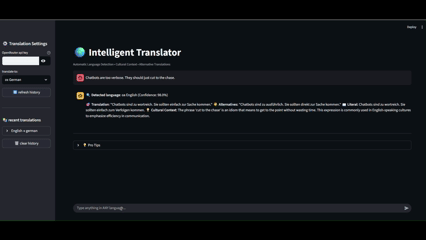

# 🌍 Intelligent Translation Bot

A culturally-aware translation assistant that goes beyond basic word swapping to provide context, alternatives, and cultural insights.

## ✨ Features

- **Automatic language detection** with confidence scoring
- **Cultural context** for idioms, slang, and regional expressions  
- **Multiple translation alternatives** when relevant
- **Formality level detection** (formal/informal/neutral)
- **Translation history** tracking
- **15+ language support** with proper flags and formatting

## 🚀 Quick Start

1. **Install dependencies:**
   ```bash
   pip install streamlit openai
   ```

2. **Run the app:**
   ```bash
   streamlit run translation_bot.py
   ```

3. **Add your openrouter api key** in the sidebar

4. **Start translating** - type anything in any language!

5. **Refresh History** - keep track of your translations.

## 💡 What Makes This Different

Unlike basic translators, this bot:
- explains cultural nuances and regional variations
- offers multiple ways to express the same idea
- detects formality levels and suggests appropriate alternatives
- provides literal translations when they differ from cultural ones

## 🎯 Perfect For

- **language learners** wanting cultural context
- **content creators** needing culturally appropriate translations  
- **travellers** understanding local expressions
- **anyone curious** about linguistic nuances

## 🧠 Technical Approach

- **two-stage ai process**: detection → translation
- **engineered system prompts** for cultural awareness
- **structured json responses** for consistent formatting
- **streamlit ui** with translation history and language selection

## 📝 Example Interactions

**input:** "it's raining cats and dogs"  
**output:** detects english idiom, translates to target language, explains the metaphorical meaning

**input:** "お疲れ様でした"  
**output:** detects japanese, explains workplace context and when to use this phrase

## 🛠️ Requirements

- python 3.7+
- streamlit
- openai python client
- openrouter api key (gpt-4o-mini model used)

## 📚 Supported Languages

english, spanish, french, german, italian, portuguese, chinese, japanese, korean, russian, arabic, hindi, dutch, swedish, norwegian


## 📽️ Demo



---
👾 _Developed By PRASHANT KUMAR. Watch this space for more updates._

---
